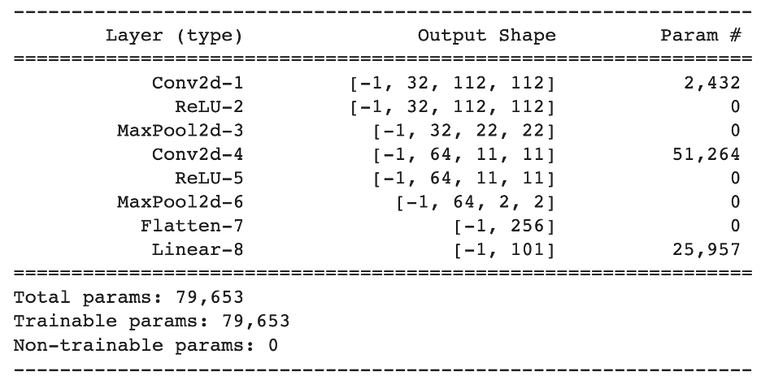
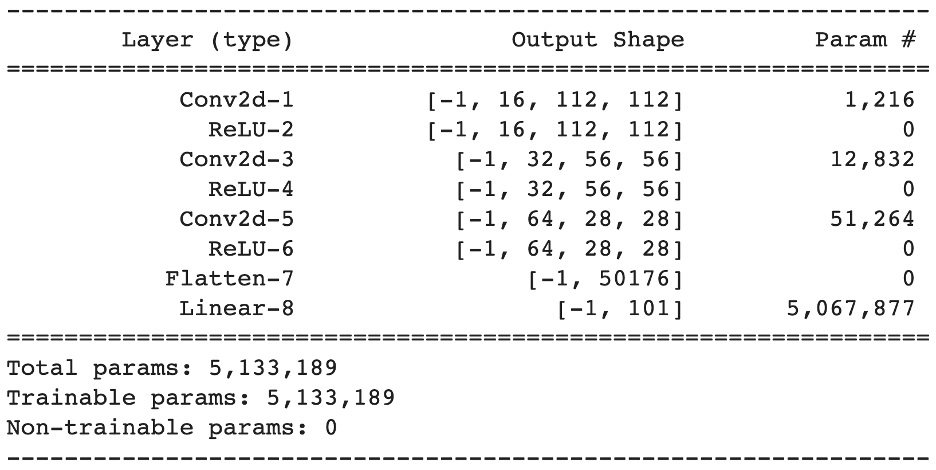
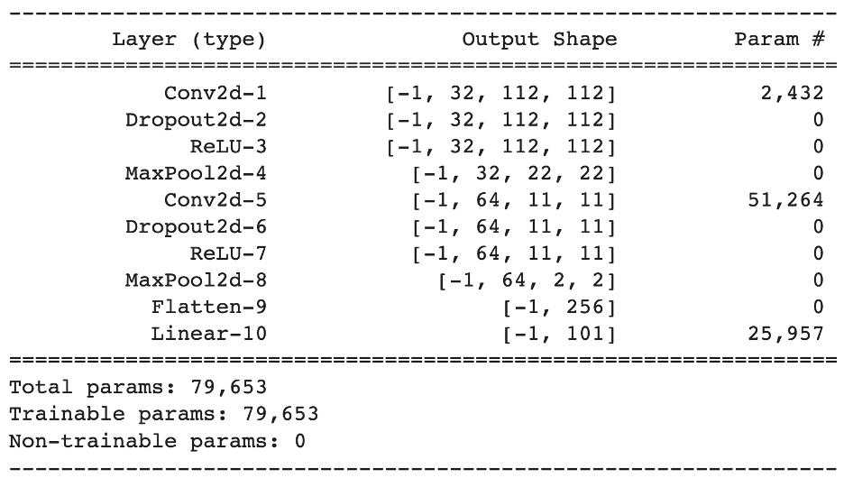

# Food 101 using Pytorch Lightining

## Basic CNN:

Architecture Details:

The basic CNN that was built consists of convolutional layers, ReLU activation functions, Max pooling and linear layers. To be specific the model has:

Convolutional layers 2d, ReLU and MaxPool layers clubbed together in everystep.

* Training Loss:      3.0  
* Validation Loss:   3.670
* Test Accuracy:     0.1765

## All Convolutional Net:

Architecture Details:

The All Convolutional Net has just convolutional nets and ReLU activation functions without any inclusion of any maxpooling or dropouts. To be specific Convolutional layer with ReLU activation have been clubbed together and layered for building the model.

* Training Loss:     1.630
* Validation Loss:  6.28
* Test Accuracy:     0.085

## Regularization on Basic CNN

Architectural details:

This is basically the basic CNN model along with drop out layers in middle of convolutional layers and activation function

| Regularized Basic CNN | Basic CNN   |
| :---:   | :---: |
| Training Loss: 3.9 | Training Loss:  3.0   |
| Validation Loss: 4.1 | Validation Loss: 3.670   |
| Test accuracy:  0.09 | Test accuracy:   0.1765   |

## Transfer Learning

ResNet50 has been used for the training of model.

| ResNet50 with pre trained weights | RestNet50 without pre trained weights   |
| :---:   | :---: |
| Training Loss : 2.03 | Training Loss  : 5.16   |
| Validation Loss: 2.46 | Validation Loss: 5.27   |